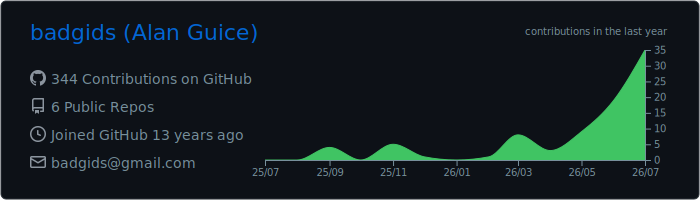
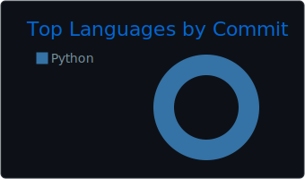
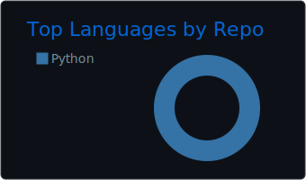
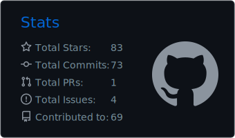
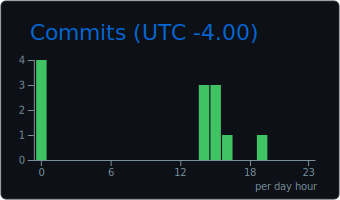

<h1>Badgids</h1>

<h3>(Alan Guice)</h3>

<strong>Technologist · Computer Scientist &amp; Software Engineer · Project Manager Musician · Maker · Community Advocate</strong>

<em>I build practical systems where technology, creative work, and real-world problem solving meet.</em>

  
  
  
  

  
  
  

<strong>“Keep the neurons firing!”</strong>

---

## 🚀 Currently building: [ComfyUI Setup Manager](https://github.com/badgids/comfyui-setup-manager)

> A standalone control center for installing, launching, updating, repairing, inspecting, exporting, importing, and sharing ComfyUI installations, models, and workflows.

ComfyUI Setup Manager combines a compact **Textual TUI** with a complete automation-friendly **CLI**. It manages multiple ComfyUI installations without forcing every setup to duplicate huge model and workflow libraries.

- Install, launch, update, repair, inspect, roll back, and remove ComfyUI setups.
- Share models and workflows safely across multiple installations.
- Export and import portable YAML-based setup profiles and workflow packs.
- Manage custom nodes, models, LoRAs, workflows, Agent Skills, and MCP definitions.
- Use every important feature through either the TUI or text, JSON, and YAML CLI output.
- Validate dependencies and custom-node startup before declaring an installation healthy.

`Python` · `Textual` · `ComfyUI` · `YAML` · `CLI/TUI` · `Linux` · `WSL2` · `Windows`

---

## About me

I am a Chattanooga-area technologist, project manager, musician, digital creator, woodworker, outdoorsman, and community advocate. Online, I work as **Badgids**. My path has never fit neatly into one lane: I move between structured systems and creative chaos, especially where the rules are still being written.

Across open-source AI, emerging industries, community organizing, music, digital media, and physical craft, I tend to serve as a **builder, organizer, communicator, and translator between worlds**. I am more interested in how a system behaves in real use than in polished hype around it.

- 🧠 **Technology & AI:** Python, automation, local inference, LLM experimentation, ComfyUI, open-source model engineering, agent tooling, and practical software.
- 🧭 **Project leadership:** Organizing cross-functional work in uncertain, fast-changing environments and translating goals, constraints, and execution.
- 🎵 **Music & media:** Writing, producing, and releasing original music as **Dead Man's Mandolin**, alongside years of YouTube experimentation and documentation.
- 🪵 **Craftsmanship:** Building tangible work through **RockCreek ShopWorks**, with a focus on woodworking and respect for the material.
- ⚖️ **Community advocacy:** Public communication and organizing around bail reform, pretrial justice, incarceration, equity, and community accountability.
- 🏕️ **Outdoors:** An Eagle Scout and lifelong camper, hiker, bushcrafter, and curious student of history, archaeology, and the natural world.

---

## The through-line

### Technology, AI & open source

My technical work emphasizes practical experimentation: build it, run it locally, find where it breaks, and make it useful. That has included automation and bots, real-time Whisper transcription, local generative-AI workflows, autonomous CAD experiments with CadQuery and CQparts, and open-source model work on Hugging Face.

I develop and merge GGUF models such as [Gonzo-Chat-7B-GGUF](https://huggingface.co/Badgids/Gonzo-Chat-7B-GGUF), built for local inference with tools including llama.cpp, Ollama, and LM Studio. I also work with ComfyUI, Flux GGUF, PuLID, local CUDA systems, and agent-compatible engineering skills.

### Civic leadership & criminal justice advocacy

Before my work at Snapdragon Hemp, I created the **Hamilton County Community Bail Fund** in partnership with **CALEB**—Chattanoogans in Action for Love, Equality and Benevolence. During this period, I also served as a Director of CALEB through a highly active era of bail-reform and pretrial-justice organizing.

I was interviewed about bail funds and pretrial detention in at least five local newspaper articles, including coverage by the *Chattanooga Times Free Press* and the *Cleveland Daily Banner*. I also co-hosted a local talk-radio program covering bail reform, criminal justice policy, community accountability, and equity.

### Project management in an emerging industry

After my bail-fund and CALEB work, I served as a **Project Manager at Snapdragon Hemp** during the hemp and CBD industry's early expansion. I coordinated work across business goals, operational realities, and a rapidly changing regulatory environment around the Farm Bill era. The job demanded comfort with uncertainty—the kind of environment where I do some of my best work.

### Music, YouTube & creative work

Music is not a side note in my life; it is another way I design systems, pacing, structure, atmosphere, and meaning. As [Dead Man's Mandolin](https://deadmansmandolin.bandcamp.com/), I write and produce original work that pulls together roots instrumentation, gothic atmosphere, indie-rock energy, and heavier influences.

My [YouTube channel](https://www.youtube.com/@badgids) began with prolific bushcraft, camping, gear, and DIY experimentation and grew to include technology, commentary, creative work, and ongoing project documentation. I use video as a public workshop and an archive of ideas in motion.

### Woodworking, the outdoors & making real things

The discipline and outdoor foundation I developed as an **Eagle Scout** still shapes how I work. Through **RockCreek ShopWorks**, I bring that mindset into woodworking—turning raw material into useful, carefully made pieces while staying connected to traditional building, the outdoors, and hands-on problem solving.

---

## Selected work

| Project                                                                       | What it explores                                                                   |
| ----------------------------------------------------------------------------- | ---------------------------------------------------------------------------------- |
| **[ComfyUI Setup Manager](https://github.com/badgids/comfyui-setup-manager)** | Portable, repairable, multi-install ComfyUI management through a full TUI and CLI. |
| **[Gonzo-Chat-7B-GGUF](https://huggingface.co/Badgids/Gonzo-Chat-7B-GGUF)**   | A merged 7B conversational model optimized for local GGUF inference.               |
| **[Gonzo-Code-7B-GGUF](https://huggingface.co/Badgids/Gonzo-Code-7B-GGUF)**   | A locally runnable merged model focused on coding and agent-oriented work.         |
| **[OpenKlyde](https://github.com/badgids/OpenKlyde)**                         | An open-source Discord bot project; collaboration and help are welcome.            |
| **[Transcription App](https://github.com/badgids/transcription-app)**         | Real-time transcription experiments powered by OpenAI Whisper.                     |

I am especially interested in collaborating on **machine learning, applied AI, local inference, automation, agent systems, and open-source tools**. Ask me about computer science, programming, ML/AI, ComfyUI, or turning an ambitious idea into a working system.

---

## Journey so far

| Era                              | Focus                                                                                                                                                                            |
| -------------------------------- | -------------------------------------------------------------------------------------------------------------------------------------------------------------------------------- |
| **Foundation**                   | Earned the rank of Eagle Scout; built a lifelong foundation in leadership, outdoor skills, service, and environmental appreciation.                                              |
| **Early digital creation**       | Became a prolific YouTube bushcraft creator, documenting outdoor skills, gear, experiments, and DIY problem solving.                                                             |
| **Community leadership**         | Created the Hamilton County Community Bail Fund in partnership with CALEB; served as a CALEB director, public spokesperson, newspaper interviewee, and local talk-radio co-host. |
| **Emerging-industry leadership** | After the bail-fund and CALEB work, served as Project Manager at Snapdragon Hemp during the Farm Bill transition and Tennessee hemp industry's rapid growth.                     |
| **2023–2024**                    | Published Gonzo Chat and Gonzo Code models on Hugging Face and developed Python, bot, transcription, and local-inference projects.                                               |
| **2026**                         | Expanded advanced local ComfyUI workflows and autonomous engineering work using CadQuery, CQparts, Agent Skills, and AI-assisted assembly interpretation.                        |
| **Now**                          | Building ComfyUI Setup Manager while continuing open-source AI work, music, YouTube creation, woodworking, and outdoor exploration.                                              |

---

## Core toolkit

<strong>📋 Languages I use</strong>

 

<strong>📚 Frameworks, platforms & libraries</strong>

 

<strong>🤖 Machine learning, data & AI</strong>

 

<strong>🧰 Infrastructure, tools & environments</strong>

 

**Cloud & hosting**  

**Servers**  

**IDEs & editors**  

**Version control**  

**Operating systems**  

**Office**  

<strong>🎨 Hardware, music & play</strong>

 

**Devices**  

**Music**  

**Gaming**  

**Consoles**  

---

## GitHub activity

 

 

 

 

 

---

## Connect & support

  

 

